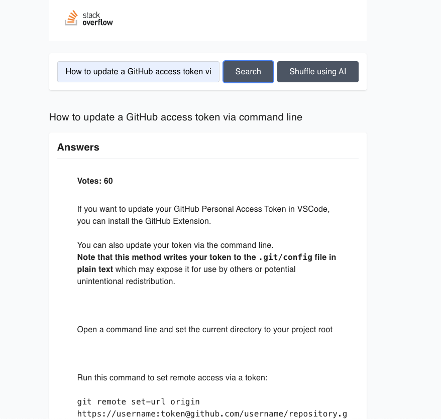
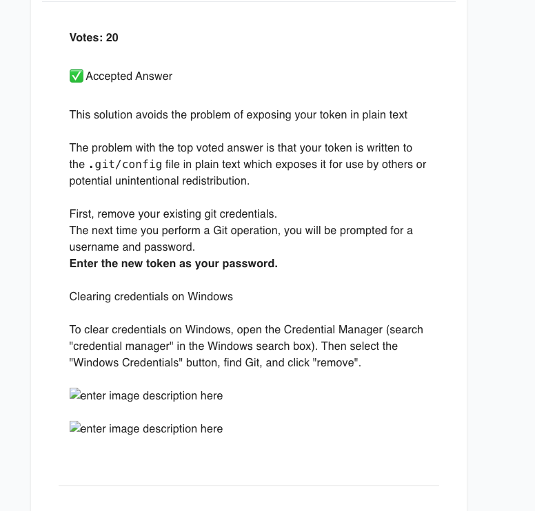
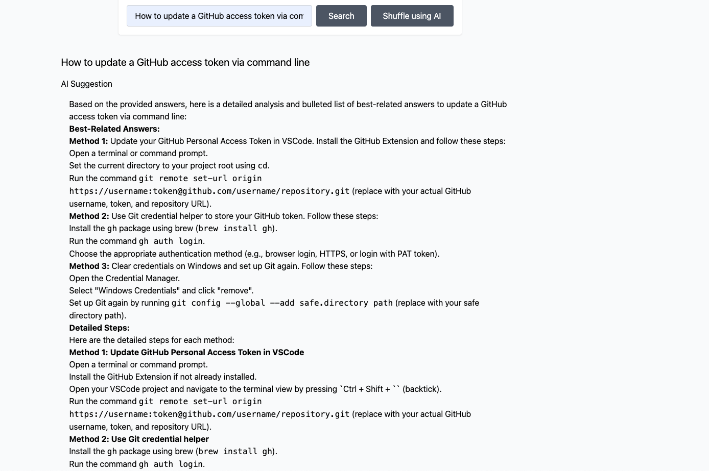
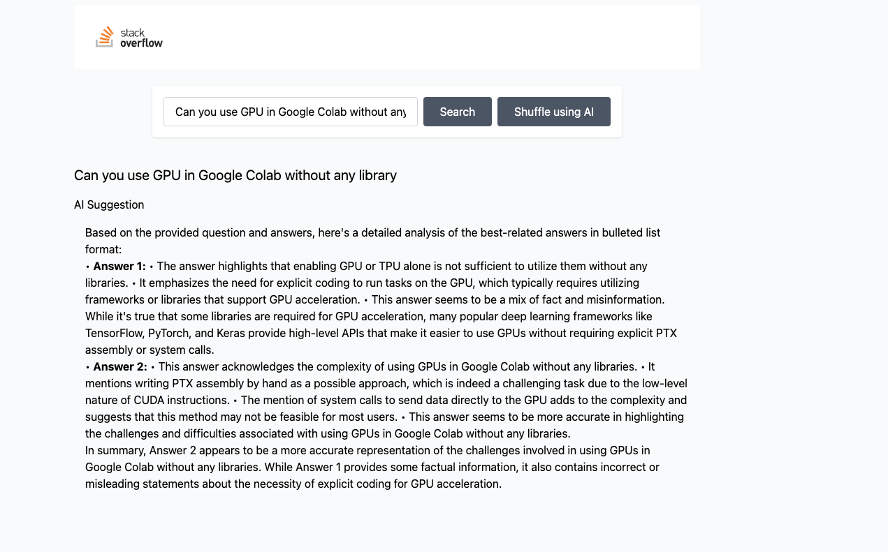

## Stackoverflow + LLM

### Quick Intro
- This application is based stackexchange API and LLM

### Tech stack used
- FrontEnd
  - React + Typescript
- Backend
    - Elixir + Pheonix
- LLM
  - local setup Ollama

## To Run the application
- Backend
  - Navigate to backend folder from the current repo
    - Run the below command
   
    ```
      - cd back_end/handle_stackoverflow/
      - mix deps.get
      - mix ecto.create
      - mix ecto.migrate

      Lastly run this to start the application local server (runs in IEX console)
      - iex -S mix phx.server 
    ```

- Frontend
  - Follow the below steps    
  ```
   - cd front_end/mini_stackoverflow
   - npm i

   - npm run dev
  ```

- LLM running locally  
  - I've installed Ollama using this (https://ollama.com/download/mac), 
  - Install this appliacation
  - For setting up run this command, this `run command` will install LLM model in your local if it doesn't exist
  - To interact with LLM model, this is local API endpoint used ( http://127.0.0.1:11434/api/generate )

  ```
    - ollama run llama3.2
      or 
    - ollama pull llama3.2

    <!-- This starts the LLM server locally, used for interacting with LLM-->
    - ollama serve 
  ```

### Images
- Home Page
  

- Related Answers
  - 

  - 

- LLM relevant Answers
  - 

  - Related to different question
    - 


  ### Assumptions made
  1. User can fecth the question based on the `Advanced search` from the stackexchange the macthing question are picked and respective answers were shown.
  2. Ollama was setup locally for the API interactions 
  3. LLM will fine tune the results and gives relevant answers
  4. Didn't choose Accepted answers, since Other answers do add some relevant value
  5. User Id is harcoded since there is not authentication/ login involved


## References
-  StackExchange API
   - https://api.stackexchange.com/docs?tab=type#docs

- Ollama GitHub
   - https://github.com/ollama/ollama


